# 👋 Olá, eu sou a Janiele Cristina!

### Desenvolvedora Full Stack Júnior

Desenvolvo aplicações web completas, criando interfaces modernas com React e construindo APIs escaláveis com Node.js. Estou sempre estudando novas tecnologias e buscando evoluir como desenvolvedora, transformando ideias em soluções completas.

 

<h3><code>janiele@github:~$ ./contribuicoes.sh</code></h3>

  

<h3><code>janiele@github:~$ quem-sou</code></h3>

<table>
<tr>

<td valign="top">

</td>

<td valign="top">

</td>

</tr>
</table>

 

<h3><code>janiele@github:~$ ls tecnologias</code></h3>

 

<h3><code>janiele@github:~$ ls projetos</code></h3>

<table>

<tr>

<td width="50%" valign="top">

### 💳 Sistema de Mensalidades

Sistema Full Stack para gerenciamento de clientes, planos, assinaturas, pagamentos e administradores.

**Stack**

- React
- TypeScript
- Node.js
- Express
- Prisma
- PostgreSQL

</td>

<td width="50%" valign="top">

### 🚗 WebCarros

Aplicação para cadastro e gerenciamento de veículos, com autenticação, dashboard e upload de imagens.

**Stack**

- React
- TypeScript
- Tailwind CSS
- Supabase

</td>

</tr>

<tr>

<td width="50%" valign="top">

### 🍕 API Pizzaria

API REST com autenticação JWT, gerenciamento de categorias, produtos, pedidos e upload de imagens.

**Stack**

- Node.js
- Express
- Prisma
- PostgreSQL
- JWT

</td>

<td width="50%" valign="top">

### 📚 Atualmente

- 🚀 Desenvolvendo aplicações Full Stack
- 📖 Estudando NestJS e Arquitetura de Software
- 💡 Aprimorando boas práticas e Clean Code
- 💚 Em busca de oportunidades como Desenvolvedora Full Stack Júnior

</td>

</tr>

</table>

 

<h3><code>janiele@github:~$ estatisticas</code></h3>

<table>
<tr>

<td align="center">

</td>

<td align="center">

</td>

</tr>
</table>

  

<h3><code>janiele@github:~$ cat contato.txt</code></h3>

